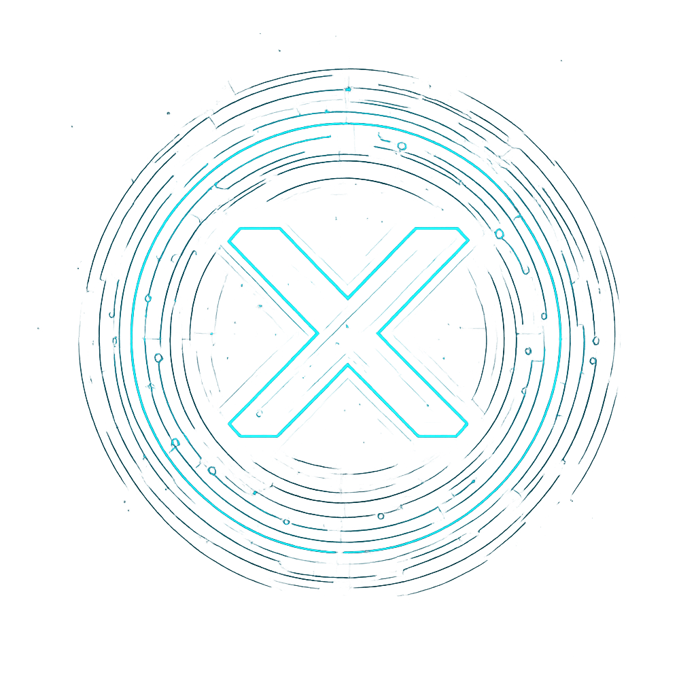

<div align="center">

<h1>xbox</h1>
<p>
xbox is a lightweight, cross-platform utility library for C, designed to accelerate the development of high-performance applications by providing a rich set of foundational tools and a clean, layered architecture. It offers everything from basic data structures to an advanced application framework, simplifying complex software construction.
</p>
</div>

> [!NOTE]
> xbox is under active development. The API is stabilizing but may still evolve.

## Features

- **Rich Data Structures**: A comprehensive collection of generic, high-performance data structures, including linked lists, bitmap, hash tables, and skip lists.
- **Structured Logging**: A powerful and extensible logging framework with configurable sinks for console, file, syslog, and more.
- **OS Abstraction Layer**: A clean portability layer that abstracts OS-specific features like threads, mutexes, and IPC, with initial support for Unix-like systems and RT-Thread.
- **Application Framework**: A high-level framework featuring:
  - **Message Bus (`mbus`)**: For decoupled, event-driven internal communication.
  - **Message Broker**: A pluggable interface for external communication with systems like NATS and MQTT.
  - **Thread Pool**: For efficient management of concurrent tasks.
- **JSON Parsing**: A fast and simple JSON parser with JSON Pointer extension support.
- **Command-Line Flag Parsing**: An easy-to-use utility for parsing command-line arguments.
- **Modern Options Parser**: A robust and feature-rich options parser with support for long options, short options, and positional arguments.

## Architecture

`xbox` is built with a clean, layered architecture to promote modularity and portability:

- **`xos` (OS Abstraction Layer)**: The lowest layer, isolating the system from platform-specific APIs for threading, synchronization, and file I/O.
- **`xlt` (Lite Tools)**: Depends only on the standard C library. It provides the core data structures, JSON parser, and command-line flag parser.
- **`xfx` (Application Framework)**: The highest layer, building upon `os` and `xtool` to provide advanced application-level features like the message bus, broker, and thread pool.

## Getting Started

### Prerequisites

- **CMake** (version 3.10 or higher)
- **Git**
- A C compiler (e.g., GCC, Clang)
- (Optional) Third-party libraries for certain framework features (e.g., `libmosquitto` for MQTT, `cnats` for NATS).

### Building the Project

> [!TIP]
> On Debian/Ubuntu, you may need to install the following development packages:
> ```bash
> sudo apt install -y \
>     libbenchmark-dev \
>     libgtest-dev \
>     libgmock-dev \
>     libsystemd-dev \
>     libnats-dev \
>     libmosquitto-dev \
>     libprotobuf-c-dev \
>     libsodium-dev \
>     pkg-config
> # The following are optional and primarily for running tests and memory checks:
> # nats-server
> # valgrind
> ```

1.  Clone the repository:

    ```bash
    # Use HTTP
    git clone -b main http://git.intretech.com:7990/scm/~yq24071/xbox.git
    # Or use SSH
    git clone -b main ssh://git@git.intretech.com:7999/~yq24071/xbox.git
    cd xbox
    ```

2.  Configure the build using CMake:

    ```bash
    cmake -S . -B build
    ```

    You can disable modules to avoid installing dependencies. For example, to disable the MQTT broker:

    ```bash
    cmake -S . -B build -DXFRAMEWORK_ENABLE_MQTT=OFF
    ```

3.  Compile the project:
    ```bash
    cmake --build build --target all --config Release -j4
    ```

## Documentation

For detailed documentation on each module, please visit the documentation index.

- **[Module Documentation](docs/en/README.md)** (Work in Progress)
- [中文文档](docs/zh/README_zh.md)

## Platform Support

| Platform   | Status          | Note                                        |
| ---------- | --------------- | ------------------------------------------- |
| Unix/Linux | Full Supported  | Actively maintained .                       |
| macOS      | Full Supported  | Minimal support (maintenance low priority). |
| RT-Thread  | Limited support | Minimal support (maintenance low priority). |
| FreeRTOS   | Limited support |                                             |
| Zephyr     | \*              |                                             |
| Windows    | \*              |                                             |
